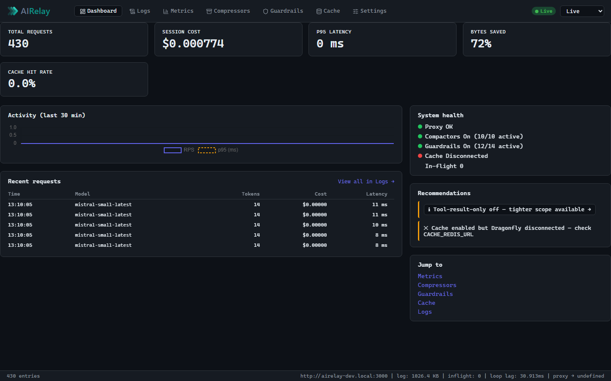

<p align="center">
  
</p>

<p align="center">
  <a href="CHANGELOG.md"></a>
  <a href="LICENSE"></a>
  <a href="https://nodejs.org"></a>
  <a href="docker-compose.yml"></a>
  <a href="https://vitest.dev"></a>
  
</p>

**An API proxy for AI** — with an **opt-in prompt compressor** that shaves bloated tool output before it hits your LLM. Sits between your codebase and any AI/LLM HTTP API (Anthropic, OpenAI, Gemini, OpenRouter, self-hosted). Forwards bytes unchanged by default; transparently shrinks them when you flip the switch. Live logs + per-request metrics in a browser dashboard.

> **What this is not:** a desktop chat client, a CLI assistant, or a browser extension. The target traffic is server-to-API SDK calls from a codebase.



→ **[All dashboard screenshots](docs/screenshots.md)** — Dashboard · Logs · Metrics · Compressors · Guardrails · Cache · Settings

---

## What you get

- **Prompt Compressor** — opt-in, deterministic prompt compression. 10 compressors shrink bloated `tool_result` content (git diffs, lockfile diffs, `ls -l`, `npm install` logs, ANSI noise, stack traces, base64 blobs) before forwarding to the LLM. Per-compressor metrics, per-request bypass via `X-Compactor: off`, default off. See [docs/COMPACTOR.md](docs/COMPACTOR.md) — including the [Before / After gallery](docs/COMPACTOR.md#41-before--after-gallery) with concrete byte + token savings per compressor.
- **Guardrails** — opt-in prompt safety. Detect secrets (AWS / GitHub / Anthropic / OpenAI keys, JWTs, private keys), PII (email, phone, credit-card with Luhn), and prompt-injection patterns in JSON request bodies. Three modes per category: **alert** (record + forward), **block** (reject 422), **redact** (replace match with `<redacted:NAME>` and forward). Per-request bypass via `X-Guardrails: off`, default off. Includes an always-on log sanitizer that strips secret-shaped tokens from persisted logs regardless of the master switch. See [docs/GUARDRAILS.md](docs/GUARDRAILS.md).
- **Multi-upstream routing** — opt-in routes table (JSON file or inline env JSON) lets one AIRelay instance fan out to multiple providers, e.g. `/proxy/anthropic/* → api.anthropic.com` and `/proxy/openai/* → api.openai.com`. Per-route provider, trust-forwarded override, longest-prefix match. Backwards-compatible with the single-upstream v0.3.0 config. Single-upstream setups also get a **zero-config `/proxy/<provider>` alias** for free — point your SDK at `/proxy` or `/proxy/mistral`, both reach the upstream with no routes table. See [docs/ROUTING.md](docs/ROUTING.md).
- **SQLite metric history, rollups, and CSV export** — opt-in persistence (`METRICS_DB_PATH`) writes every event to a local SQLite database via a batched write-behind queue. Unlocks `/api/metrics/history`, `/api/metrics/rollups?period=hour|day|week`, and `/api/metrics/export.csv`. Dashboard gains a route filter, time-window selector (Live / 5m / 10m / 15m / 30m / 1h / 3h / 6h / 12h / 24h / 7d — drives both the recent table and the RPS / latency / token charts), and CSV download button. See [CONFIGURATION.md §Metric persistence](CONFIGURATION.md#metric-persistence-v040).
- **Token & cost tracking** — per-request input/output tokens + USD cost for 17 providers ([full list in CONFIGURATION.md](CONFIGURATION.md#token--cost-tracking)). Per-model breakdown via `/api/metrics/models`, sortable by spend.
- **17 providers** out of the box — Anthropic, OpenAI, Azure, Gemini, xAI, OpenRouter, Together, Fireworks, Groq, Cerebras, DeepSeek, Perplexity, Mistral, NVIDIA, Microsoft, AnLinkAI, Ollama — plus a `generic` mode for anything else.
- **Live dashboard.** Dashboard · Logs · Metrics · Compressors · Guardrails · Cache · Settings — updated in real time via SSE. Landing tab shows KPIs, activity sparkline, system health, and recommendations.
- **Transparent passthrough** by default. Streaming AI responses (SSE / chunked) flow through unmodified — your SDK doesn't know the proxy is there.
- **Settings tab.** Runtime toggles for Compactor, Guardrails, and Cache — no restart required. Saved to `data/settings.json`.
- **Single Docker container.** No system cron. Optional Dragonfly sidecar for caching (`--profile cache`); optional SQLite for metric history (`METRICS_DB_PATH`). Bring `UPSTREAM_URL` and go.
- **Automated E2E** — Playwright covers Logs, Metrics, Compressors (+ hash-routed Setup) in ~8 s. No Docker required for CI: `npm run test:e2e`. See [docs/e2e-test-plan.md](docs/e2e-test-plan.md).

What shipped in each release: [CHANGELOG.md](CHANGELOG.md). What's coming next: [ROADMAP.md](ROADMAP.md).

---

## 60-second quickstart

```bash
git clone https://github.com/<your-org>/airelay.git
cd airelay
cp .env.example .env
docker compose up --build
```

Open **`http://localhost:3000`** in a browser. If `UPSTREAM_URL` isn't set, the dashboard's **Setup tab** generates the `.env` you need — paste it in, restart, done.

Then point your SDK at `http://localhost:3000/proxy`:

```js
import Anthropic from "@anthropic-ai/sdk";
const client = new Anthropic({
  apiKey: process.env.ANTHROPIC_API_KEY,
  baseURL: "http://localhost:3000/proxy",
});
```

That's it. Every request now flows through the proxy and shows up on the dashboard. (The provider-named path — e.g. `http://localhost:3000/proxy/mistral` — works too, no extra config.)

To enable the Compressor, flip `COMPACTOR_ENABLED=true` in `.env` and restart — env vars are pre-plumbed in `docker-compose.yml`, no side-car required. Full reference: [docs/COMPACTOR.md](docs/COMPACTOR.md).

### Smoke-test with mock upstream

Verify the proxy end-to-end without a real API key using the Mistral-based E2E playbook:

```bash
# Quick health check (requires a running proxy):
curl -s http://localhost:3000/health

# Full E2E walkthrough:
# See docs/e2e-test-plan.md
```

Full instructions: [docs/e2e-test-plan.md](docs/e2e-test-plan.md)

---

## Going further

| If you want to… | Read |
|---|---|
| Install on Windows / macOS / Linux step-by-step | [INSTALL.md](INSTALL.md) |
| Configure env vars, providers, DNS, TLS | [CONFIGURATION.md](CONFIGURATION.md) |
| Understand the architecture (diagrams) | [docs/ARCHITECTURE.md](docs/ARCHITECTURE.md) |
| Cut a release | [docs/RELEASING.md](docs/RELEASING.md) |
| See what's coming next | [ROADMAP.md](ROADMAP.md) |
| See what shipped | [CHANGELOG.md](CHANGELOG.md) |

---

## Provider compatibility

| Provider | `UPSTREAM_URL` | `PROXY_PROVIDER` |
|---|---|---|
| Anthropic | `https://api.anthropic.com` | `anthropic` |
| OpenAI | `https://api.openai.com/v1` | `openai` |
| Azure OpenAI | `https://<resource>.openai.azure.com` | `azure` |
| Google Gemini | `https://generativelanguage.googleapis.com` | `google` |
| xAI (Grok) | `https://api.x.ai/v1` | `xai` |
| OpenRouter | `https://openrouter.ai/api/v1` | `openrouter` |
| Together AI | `https://api.together.xyz/v1` | `together` |
| Fireworks AI | `https://api.fireworks.ai/inference/v1` | `fireworks` |
| AnLinkAI (beta) | `https://api.anlinkai.com/api/v1` | `anlinkai` |
| Cerebras | `https://api.cerebras.ai/v1` | `cerebras` |
| Groq | `https://api.groq.com/openai/v1` | `groq` |
| DeepSeek | `https://api.deepseek.com/v1` | `deepseek` |
| Perplexity | `https://api.perplexity.ai` | `perplexity` |
| Mistral | `https://api.mistral.ai` | `mistral` |
| NVIDIA NIM | `https://integrate.api.nvidia.com/v1` | `nvidia` |
| Microsoft | (per Azure deployment) | `microsoft` |
| Ollama (self-hosted) | `http://<host>:11434` | `ollama` |
| Custom / other | any HTTP/HTTPS endpoint | `generic` |

**Not compatible:** AWS Bedrock and other SigV4-signed APIs (the proxy rewrites the `Host` header, which invalidates SigV4 signatures). See [CONFIGURATION.md](CONFIGURATION.md#not-supported-aws-bedrock).

---

## Tech stack

Node.js 24+ · Express · `http-proxy-3` · vanilla JS dashboard with Chart.js · Vitest · Docker multi-stage (`node:24.15-alpine3.22`).

---

## Contributing

1. Branch from `develop`.
2. `npm run lint && npm test` must pass.
3. Conventional Commits (`feat:`, `fix:`, `chore:`, …).
4. PR with summary + test plan.

---

## License

[MIT](LICENSE) © 2026 Kim Sandell
