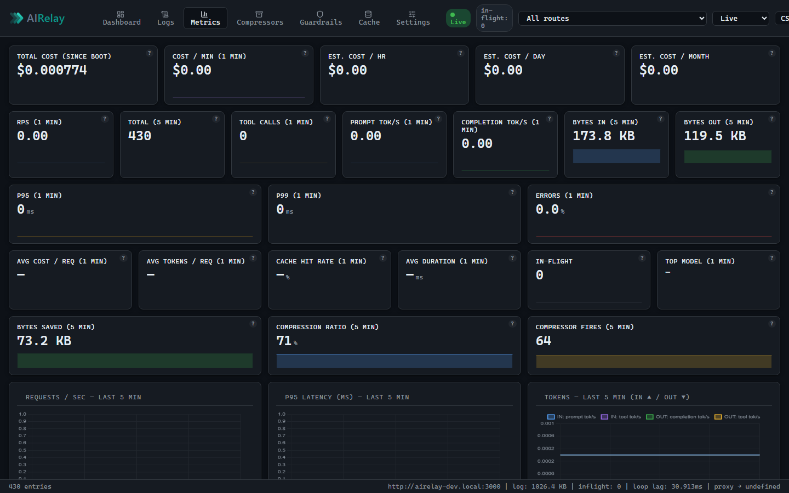

# AIRelay

[](CHANGELOG.md)
[](LICENSE)
[](https://nodejs.org)
[](docker-compose.yml)
[](https://vitest.dev)
[]()

**An API proxy for AI.** Sits between your codebase and any AI/LLM HTTP API (Anthropic, OpenAI, Gemini, OpenRouter, self-hosted). Forwards bytes unchanged. Surfaces live logs + per-request metrics in a browser dashboard.

> **What this is not:** a desktop chat client, a CLI assistant, or a browser extension. The target traffic is server-to-API SDK calls from a codebase.

---

## What you get

- **Transparent passthrough.** Streaming AI responses (SSE / chunked) flow through unmodified — your SDK doesn't know the proxy is there.
- **Live dashboard.** RPS, p50/p95/p99, error rate, status pills, network + token throughput (In/Out), tokens/sec, recent-requests feed — updated in real time.
- **Guided setup.** First time you open the dashboard, a Setup tab walks you through generating the right `.env` for your provider.
- **Token & cost tracking** — per-request input/output tokens + USD cost for 17 providers ([full list in CONFIGURATION.md](CONFIGURATION.md#token--cost-tracking)).
- **Per-model breakdown** — cost/token aggregates via `/api/metrics/models`, sortable by spend.
- **Single Docker container.** No DB, no Redis, no system cron. Bring `UPSTREAM_URL` and go.
- **Cross-platform.** Identical on Windows Docker Desktop, macOS, and Linux.

What shipped in each release: [CHANGELOG.md](CHANGELOG.md). What's coming next: [ROADMAP.md](ROADMAP.md).



---

## 60-second quickstart

```bash
git clone https://github.com/<your-org>/airelay.git
cd airelay
cp .env.example .env
docker compose up --build
```

Open **`http://localhost:3000`** in a browser. If `UPSTREAM_URL` isn't set, the dashboard's **Setup tab** generates the `.env` you need — paste it in, restart, done.

Then point your SDK at `http://localhost:3000/proxy`:

```js
import Anthropic from "@anthropic-ai/sdk";
const client = new Anthropic({
  apiKey: process.env.ANTHROPIC_API_KEY,
  baseURL: "http://localhost:3000/proxy",
});
```

That's it. Every request now flows through the proxy and shows up on the dashboard.

### Smoke-test with mock upstream

Verify the proxy end-to-end without a real API key using the Mistral-based E2E playbook:

```bash
# Quick health check (requires a running proxy):
curl -s http://localhost:3000/health

# Full E2E walkthrough:
# See docs/e2e-test-plan.md
```

Full instructions: [docs/e2e-test-plan.md](docs/e2e-test-plan.md)

---

## Going further

| If you want to… | Read |
|---|---|
| Install on Windows / macOS / Linux step-by-step | [INSTALL.md](INSTALL.md) |
| Configure env vars, providers, DNS, TLS | [CONFIGURATION.md](CONFIGURATION.md) |
| Understand the architecture (diagrams) | [docs/ARCHITECTURE.md](docs/ARCHITECTURE.md) |
| Cut a release | [docs/RELEASING.md](docs/RELEASING.md) |
| See what's coming next | [ROADMAP.md](ROADMAP.md) |
| See what shipped | [CHANGELOG.md](CHANGELOG.md) |

---

## Provider compatibility

| Provider | `UPSTREAM_URL` | `PROXY_PROVIDER` |
|---|---|---|
| Anthropic | `https://api.anthropic.com` | `anthropic` |
| OpenAI | `https://api.openai.com/v1` | `openai` |
| Azure OpenAI | `https://<resource>.openai.azure.com` | `azure` |
| Google Gemini | `https://generativelanguage.googleapis.com` | `google` |
| xAI (Grok) | `https://api.x.ai/v1` | `xai` |
| OpenRouter | `https://openrouter.ai/api/v1` | `openrouter` |
| Together AI | `https://api.together.xyz/v1` | `together` |
| Fireworks AI | `https://api.fireworks.ai/inference/v1` | `fireworks` |
| AnLinkAI (beta) | `https://api.anlinkai.com/api/v1` | `anlinkai` |
| Cerebras | `https://api.cerebras.ai/v1` | `cerebras` |
| Groq | `https://api.groq.com/openai/v1` | `groq` |
| DeepSeek | `https://api.deepseek.com/v1` | `deepseek` |
| Perplexity | `https://api.perplexity.ai` | `perplexity` |
| Mistral | `https://api.mistral.ai` | `mistral` |
| NVIDIA NIM | `https://integrate.api.nvidia.com/v1` | `nvidia` |
| Microsoft | (per Azure deployment) | `microsoft` |
| Ollama (self-hosted) | `http://<host>:11434` | `ollama` |
| Custom / other | any HTTP/HTTPS endpoint | `generic` |

**Not compatible:** AWS Bedrock and other SigV4-signed APIs (the proxy rewrites the `Host` header, which invalidates SigV4 signatures). See [CONFIGURATION.md](CONFIGURATION.md#not-supported-aws-bedrock).

---

## Tech stack

Node.js 22+ · Express · `http-proxy` · vanilla JS dashboard with Chart.js · Vitest · Docker multi-stage (`node:22-alpine`).

---

## Contributing

1. Branch from `main`.
2. `npm run lint && npm test` must pass.
3. Conventional Commits (`feat:`, `fix:`, `chore:`, …).
4. PR with summary + test plan.

---

## License

[MIT](LICENSE) © 2026 Kim Sandell
