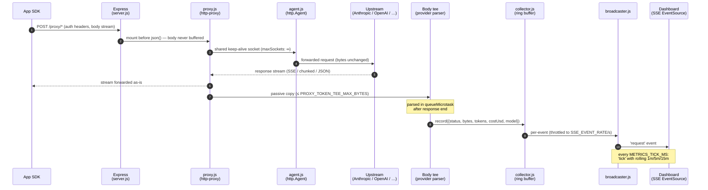
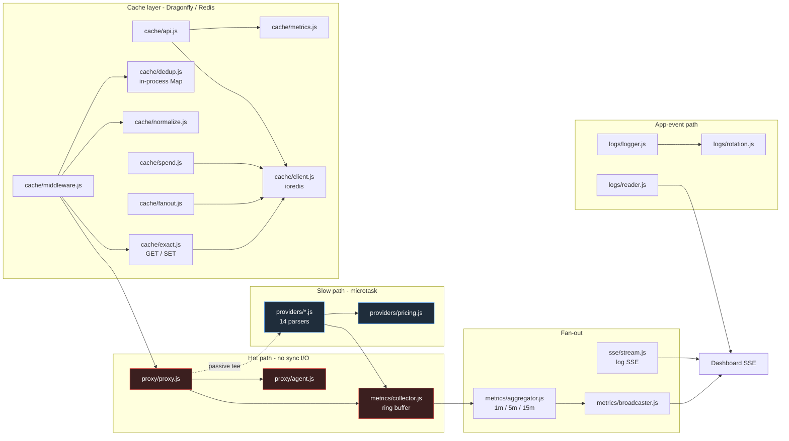
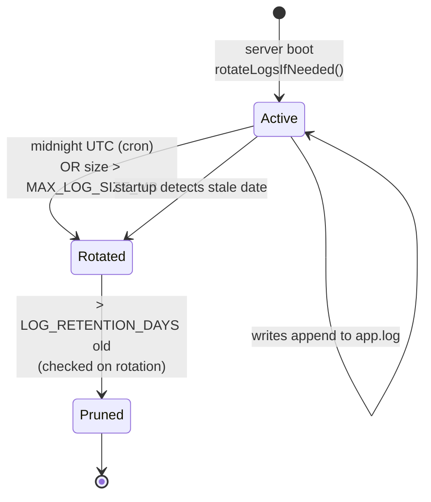

# Architecture

Canonical architecture reference for AIRelay. All other docs link here — do not
duplicate diagrams or module descriptions elsewhere.

## Request lifecycle (proxied call)



**Hot-path invariants** — zero sync I/O, zero body buffering on the SDK-facing
stream, zero allocations beyond the metric event itself. The tee is a passive
observer; if it overflows or fails to parse, the base metric is still recorded.

## Module map



The logger is **never** invoked per proxied request — it exists for app events
(startup, cron, errors). The metric event path is the only per-request
observability mechanism.

## Cache (v0.6.0, opt-in)

A caching layer mounted **before Compactor** on every proxy route prefix.
Inert when `CACHE_ENABLED=false` (default — single boolean check, zero overhead).

```
src/cache/
├── middleware.js    Hit: short-circuits with cached response (no upstream call).
│                   Miss: buffers request body in req._cacheBodyBuffer (body-buffer
│                   contract — Compactor/Guardrails read this instead of re-consuming
│                   the stream), then tees the upstream response into Redis via
│                   queueMicrotask after response end.
├── exact.js        GET/SET for exact-match cache entries (Dragonfly/Redis)
├── dedup.js        In-flight deduplication via in-process Map (coalesces concurrent
│                   identical requests onto a single upstream call)
├── normalize.js    Request key normalisation (strips non-deterministic fields)
├── spend.js        Per-key spend tracking written back to Redis
├── fanout.js       Broadcasts cache hit/miss events into the metrics pipeline
├── metrics.js      Parallel ring buffer + lifetime counters for cache events
├── api.js          /api/cache/summary and /api/cache/recent endpoints
└── client.js       ioredis connection factory (singleton); used by all sub-modules
```

On a cache hit the response is returned immediately — no Compactor, Guardrails,
or upstream call runs. On a miss the upstream response is teed into Redis in a
`queueMicrotask` after `res.finish`, preserving the hot-path zero-sync-I/O invariant.

## Compactor (v0.3.0, opt-in)

A second per-request pipeline, mounted under the same proxy prefix but
**after** the cache middleware and **before** `proxy.js`.
Inert when `COMPACTOR_ENABLED=false` (default).

```
src/compactor/
├── middleware.js         Express middleware: activation check, body buffering, dispatch
├── pipeline.js           Fixed-order compressor application + banner injection
├── registry.js           Loads enabled compressors based on COMPACTOR_* env vars
├── banner.js             "[compactor: applied filters=…; bytes …→…; X-Compactor: off to bypass]"
├── metrics.js            Parallel ring buffer + lifetime counters (per compressor + totals)
├── compressors/          10 pure-function transforms (ansi-strip, diff-collapse, …)
└── providers/            Provider-aware parsers: anthropic.js, openai.js, passthrough.js
```

The middleware buffers the JSON body (capped by `COMPACTOR_MAX_REQ_BYTES`),
parses it, walks provider-specific message shapes, runs the compressor
pipeline on each eligible text segment, and stashes the mutated body on
`req._compactorBody`. The proxy handler then forwards via http-proxy's
`buffer` option instead of the consumed request stream.

Streaming requests (`stream: true`) bypass entirely with a header banner.
The full feature reference is in [COMPACTOR.md](../docs/COMPACTOR.md).

## Multi-upstream routing (v0.4.0, opt-in)

```
src/routes/
└── registry.js   Loads PROXY_ROUTES env / ROUTES_CONFIG_PATH file;
                  falls back to UPSTREAM_URL+PROXY_PATH_PREFIX+PROXY_PROVIDER.
                  Sorts by descending prefix length so longer matches win.
                  Attaches a per-route provider instance for token tracking.
```

`server.js` iterates `getRoutes()` at startup and mounts the Cache + Compactor +
Guardrails + proxy handler under each route's prefix. The proxy handler is a
closure over the route so the upstream URL, agent, and provider are pre-
resolved (no per-request lookup on the hot path). Full reference in
[ROUTING.md](../docs/ROUTING.md).

## Metric persistence (v0.4.0, opt-in)

```
src/metrics/
└── store.js   Opens better-sqlite3 connection when METRICS_DB_PATH is set.
               record() in collector.js calls enqueue() synchronously; flush
               timer drains the queue every METRICS_WRITE_BATCH_MS or when
               the queue reaches METRICS_WRITE_BATCH_SIZE.
```

Hot-path discipline: `enqueue()` is synchronous, allocation-light, and only
pushes onto an in-memory queue. Actual SQLite inserts happen on the flush
timer in a single transaction. Daily cron `pruneOlderThan(retentionDays)`
keeps the DB bounded. Endpoints `/api/metrics/{history,rollups,export.csv}`
unlock when the store is open; otherwise they return 503 with a helpful
message (except `export.csv` which falls back to the ring buffer).

## Guardrails (v0.4.0, opt-in)

A third per-request pipeline, mounted under the proxy prefix **after**
Compactor and **before** `proxy.js`. Inert when `GUARDRAILS_ENABLED=false`
(default).

```
src/guardrails/
├── middleware.js          Express middleware: activation, bypass header, buffering, dispatch
├── registry.js            Built-in + custom detector catalog (regex + per-detector gating)
├── scanner.js             Pure match/redact functions; longest-match overlap resolution
├── banner.js              "[guardrails: redact detectors=…; bytes …→…; X-Guardrails: off]"
├── metrics.js             Parallel ring buffer + lifetime counters (per detector + totals)
└── sanitizer.js           Always-on URL + error-message scrubber (independent of master switch)
```

Three modes per category (`secrets` / `pii` / `injection`): **alert**
(record + forward), **block** (reject 422), **redact** (replace match
with `<redacted:NAME>` and forward). Block beats redact. Body is re-parsed
after redaction; on parse failure the original bytes go through unchanged.
The mutated buffer lives on `req._guardrailsBody`, which the proxy handler
prefers over `req._compactorBody`. Sanitizer is wired into `requestLogger`
and `errorHandler` to redact secret-shaped tokens from persisted log
entries — runs even when the master switch is off.

The full feature reference is in [GUARDRAILS.md](../docs/GUARDRAILS.md).

## E2E test bootstrap (v0.3.0)

Playwright E2E runs against an **in-process** Node bootstrap — no Docker
required for local runs or CI:

```
tests/e2e/fixtures/test-server.js
  ├─ fake LLM upstream  (http.Server, random port, fixed Mistral response)
  └─ AIRelay createApp() on port 3100, pointing at the fake upstream
```

Playwright's `webServer` block (see `playwright.config.js`) spawns this
script, waits on `/health`, then runs two project suites:

- `functional` — 14 specs across all 4 tabs (Setup, Logs, Metrics, Compactor)
- `visual` — 5 screenshot snapshots vs OS-pinned baselines

Determinism techniques:

| Source of jitter | Mitigation |
|---|---|
| Chart.js animations | `?testMode=1` → `Chart.defaults.animation = false` |
| CSS transitions | `html[data-test-mode='1'] *` zeros animation + transition durations |
| LLM token randomness | Fake upstream returns fixed `prompt_tokens: 12, completion_tokens: 2` |
| Cross-test state leak | `POST /api/test/reset` endpoint (gated to `NODE_ENV=test`) |
| Dynamic timestamps in DOM | Playwright `mask: [#compactorRecentTable]` in screenshot calls |
| Render jitter | `maxDiffPixelRatio: 0.03` |
| Parallel races | `fullyParallel: false`, `workers: 1` (in-process shared state) |

CI workflow: `.github/workflows/e2e.yml` (push to main + manual dispatch).
Visual baselines OS-pinned — Windows baselines committed; Linux baselines
generated on first CI run via `--update-snapshots` (one-time bless).

Full E2E playbook (including the legacy manual Mistral verification) is
in [e2e-test-plan.md](e2e-test-plan.md).

## Log rotation lifecycle



Active file: `app.log`. Rotated: `app-YYYY-MM-DD.log` (UTC date). Default
retention 7 days; size guard checks every 5 min.

## API surface

```
GET  /health                          uptime, proxy state, upstream reachability, runtime stats

# Logs
GET  /api/logs?limit=500              tail of active log
GET  /api/logs/available              rotated files index
GET  /api/logs/history?date=…         specific rotated file
GET  /api/logs/stream                 SSE — live entries

# Metrics
GET  /api/metrics/summary             snapshot + 1m/5m/15m windows
GET  /api/metrics/recent?limit=200    last N proxied requests
GET  /api/metrics/models              per-model cost/token, sorted by cost desc
GET  /api/metrics/stream              SSE — 'request' (per call) + 'tick' (every METRICS_TICK_MS)

# Proxy
ANY  <PROXY_PATH_PREFIX>/*            transparent passthrough to UPSTREAM_URL
                                        (optionally via Compactor middleware — v0.3.0, default off)

# Compactor (v0.3.0, when COMPACTOR_ENABLED=true)
GET  /api/compactor/summary           lifetime + 1m/5m/15m windows of compression metrics
GET  /api/compactor/recent            last N per-request compactor events
GET  /api/guardrails/summary          guardrails state + lifetime + windowed aggregates
GET  /api/guardrails/recent           last N per-request guardrails events
GET  /api/metrics/routes              active routes (v0.4.0 multi-upstream)
GET  /api/metrics/history             time-range events from SQLite (when METRICS_DB_PATH set)
GET  /api/metrics/rollups             bucketed aggregates (hour/day/week) — requires SQLite
GET  /api/metrics/export.csv          CSV download; falls back to ring buffer when SQLite off

# Cache (v0.6.0, when CACHE_ENABLED=true)
GET  /api/cache/summary               enabled, connected, keyCount, lifetime hit/miss counters
GET  /api/cache/recent                last N per-request cache events
```

## Key design decisions

- **Passthrough = no modification.** Bytes flow through `http-proxy` streams
  unchanged. Byte counters use passive `data` listeners.
- **Hot path zero sync I/O.** No `appendFileSync`, no `JSON.parse` of payloads,
  no compression. `metrics.record()` is O(1) with no allocations beyond the
  event object.
- **Pre-allocated ring buffer.** `MAX_METRIC_EVENTS`-sized array; `head`
  rotates with no `push`/`shift` — bounded GC churn under load.
- **Shared outbound HTTP agent.** Default Node agent caps `maxSockets` at
  5/host; we override to ∞ so concurrency isn't serialized.
- **SSE caps + non-blocking writes.** `MAX_SSE_CLIENTS` evicts oldest on
  overflow; slow clients drop frames rather than queue.
- **DNS-first deployment.** `BIND_HOST=0.0.0.0`. Code never references
  `localhost`. `PUBLIC_BASE_URL` is informational; routing happens via
  Tailscale MagicDNS or hosts file.
- **`dotenv` is a devDependency**, loaded only when `NODE_ENV !== 'production'`.
  Docker injects vars directly.

For env vars see [../CONFIGURATION.md](../CONFIGURATION.md).
For release process see [RELEASING.md](RELEASING.md).

## Performance & Limits

### Hot-path invariants

| Invariant | Why |
|---|---|
| Zero sync I/O on proxy path | `appendFileSync`/`readFileSync` stall the event loop — banned from `proxy.js`, `middleware/`, hot-path code |
| Zero body buffering **(for non-opted-in traffic)** | `http-proxy` streams bytes unchanged; tee is a passive `data` listener. **Opted-in Cache traffic** (v0.6.0, `CACHE_ENABLED=true`) buffers the request body in `req._cacheBodyBuffer` on a miss; Compactor and Guardrails read from this buffer (body-buffer contract) instead of re-consuming the stream. **Opted-in Compactor traffic** (v0.3.0, `COMPACTOR_ENABLED=true` + no `X-Compactor: off`) also buffers the JSON body to mutate it — see [COMPACTOR.md](../docs/COMPACTOR.md). Default-off behavior preserves the byte-identical passthrough invariant. |
| Token extraction in `queueMicrotask` | Deferred until after `res.finish` — never inline |
| O(1) metric record | Ring buffer pre-allocated; `record()` is a single array slot write |
| Aggregator single-pass | `summary()` scans the ring once for all three windows; result memoized 1 s |

### Capacity knobs

| Env var | Default | Effect |
|---|---|---|
| `MAX_METRIC_EVENTS` | 10 000 | Ring buffer slots; older events overwritten |
| `MAX_SSE_CLIENTS` | 50 | Hard cap; oldest client evicted on overflow |
| `SSE_EVENT_RATE` | 50 | Per-second `request` event budget per tick window |
| `METRICS_TICK_MS` | 1 000 | How often the `tick` aggregate is pushed to dashboards |
| `PROXY_TOKEN_TEE_MAX_BYTES` | 2 097 152 (2 MB) | Per-request tee buffer cap; overflow drops token extraction |
| `PROXY_REQUEST_IDLE_TIMEOUT_MS` | 120 000 (2 min) | Hung upstream destroyed after this; 0 = disabled |

### Observed throughput envelope

Measured on a single-core container (1 vCPU, 512 MB) with 50 SSE dashboard clients:

- **Proxy throughput:** ≥ 500 rps sustained (passthrough, no token tracking)
- **With token tracking:** ≥ 200 rps (tee adds one `Buffer.concat` per response)
- **`/api/metrics/summary` p99:** < 5 ms (single-pass aggregator, 1 s memoize)
- **Log write latency:** < 1 ms (async `WriteStream` + `cork`/`uncork` batching)

These are floor numbers on commodity hardware. Memory footprint is bounded by ring buffer size + SSE client count.
