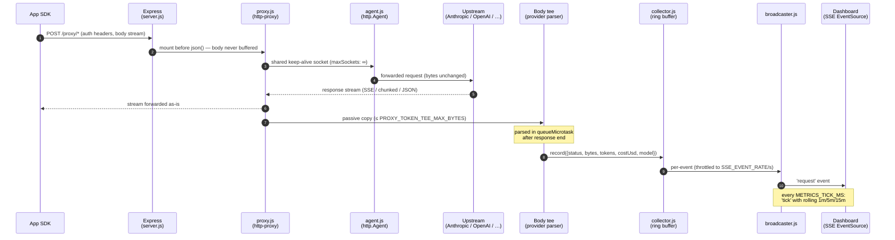
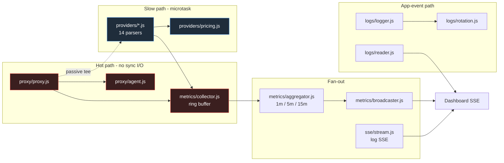
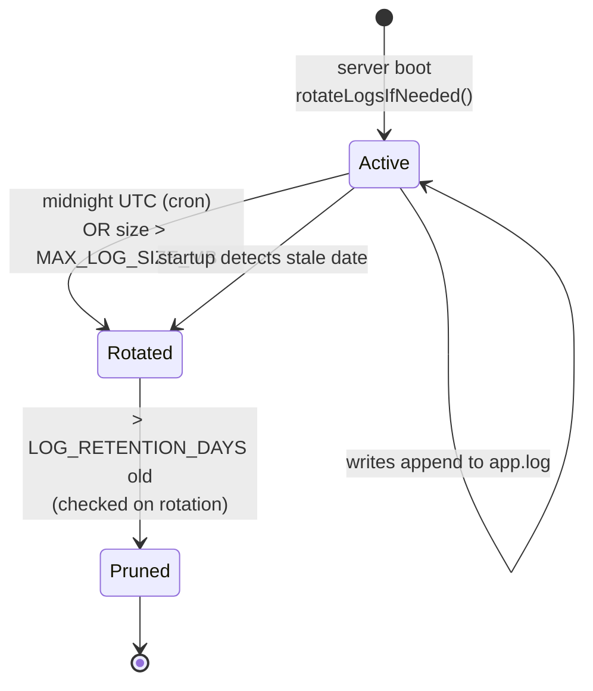

# Architecture

Canonical architecture reference for AIRelay. All other docs link here — do not
duplicate diagrams or module descriptions elsewhere.

## Request lifecycle (proxied call)



**Hot-path invariants** — zero sync I/O, zero body buffering on the SDK-facing
stream, zero allocations beyond the metric event itself. The tee is a passive
observer; if it overflows or fails to parse, the base metric is still recorded.

## Module map



The logger is **never** invoked per proxied request — it exists for app events
(startup, cron, errors). The metric event path is the only per-request
observability mechanism.

## Log rotation lifecycle



Active file: `app.log`. Rotated: `app-YYYY-MM-DD.log` (UTC date). Default
retention 7 days; size guard checks every 5 min.

## API surface

```
GET  /health                          uptime, proxy state, upstream reachability, runtime stats

# Logs
GET  /api/logs?limit=500              tail of active log
GET  /api/logs/available              rotated files index
GET  /api/logs/history?date=…         specific rotated file
GET  /api/logs/stream                 SSE — live entries

# Metrics
GET  /api/metrics/summary             snapshot + 1m/5m/15m windows
GET  /api/metrics/recent?limit=200    last N proxied requests
GET  /api/metrics/models              per-model cost/token, sorted by cost desc
GET  /api/metrics/stream              SSE — 'request' (per call) + 'tick' (every METRICS_TICK_MS)

# Proxy
ANY  <PROXY_PATH_PREFIX>/*            transparent passthrough to UPSTREAM_URL
```

## Key design decisions

- **Passthrough = no modification.** Bytes flow through `http-proxy` streams
  unchanged. Byte counters use passive `data` listeners.
- **Hot path zero sync I/O.** No `appendFileSync`, no `JSON.parse` of payloads,
  no compression. `metrics.record()` is O(1) with no allocations beyond the
  event object.
- **Pre-allocated ring buffer.** `MAX_METRIC_EVENTS`-sized array; `head`
  rotates with no `push`/`shift` — bounded GC churn under load.
- **Shared outbound HTTP agent.** Default Node agent caps `maxSockets` at
  5/host; we override to ∞ so concurrency isn't serialized.
- **SSE caps + non-blocking writes.** `MAX_SSE_CLIENTS` evicts oldest on
  overflow; slow clients drop frames rather than queue.
- **DNS-first deployment.** `BIND_HOST=0.0.0.0`. Code never references
  `localhost`. `PUBLIC_BASE_URL` is informational; routing happens via
  Tailscale MagicDNS or hosts file.
- **`dotenv` is a devDependency**, loaded only when `NODE_ENV !== 'production'`.
  Docker injects vars directly.

For env vars see [../CONFIGURATION.md](../CONFIGURATION.md).
For release process see [RELEASING.md](RELEASING.md).
