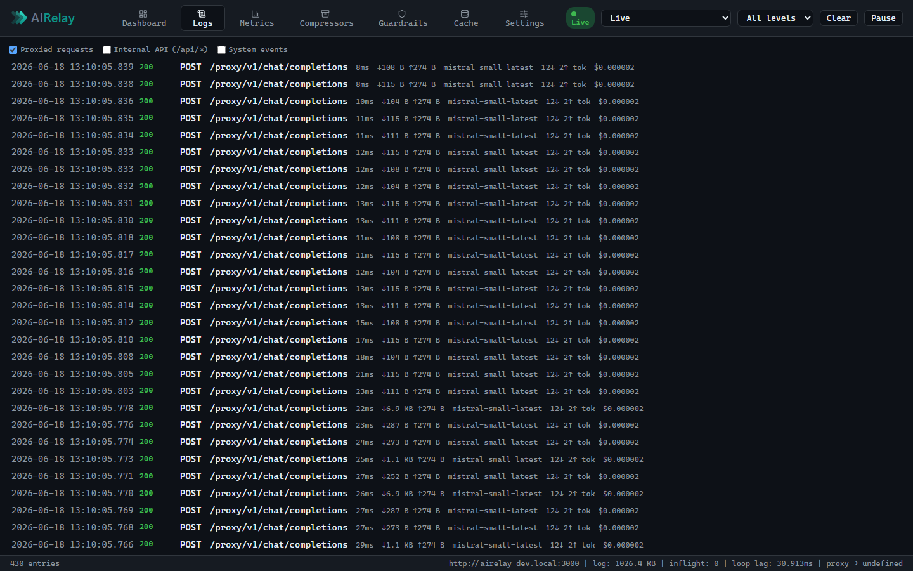
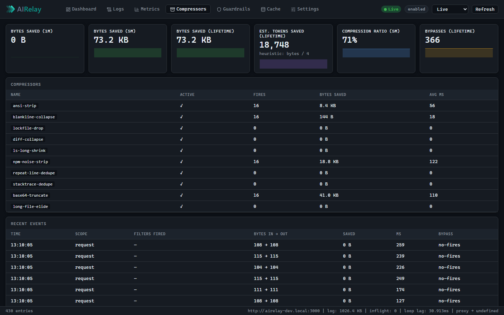
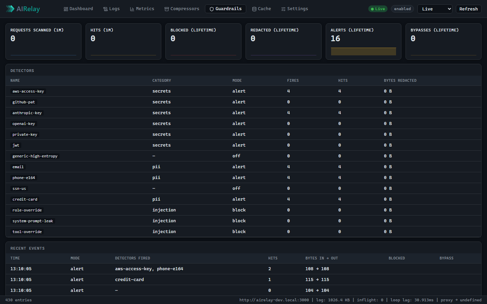
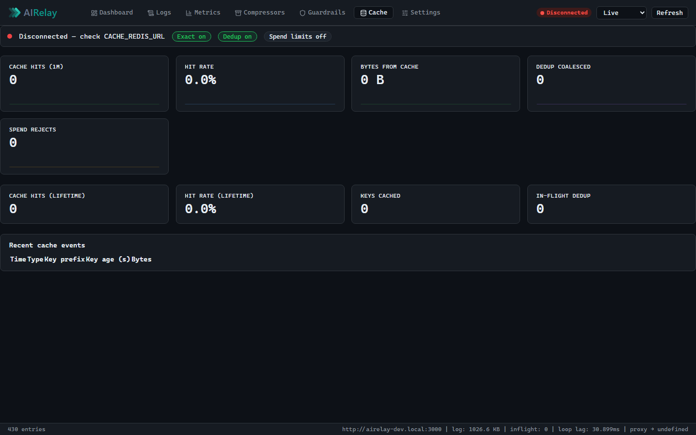
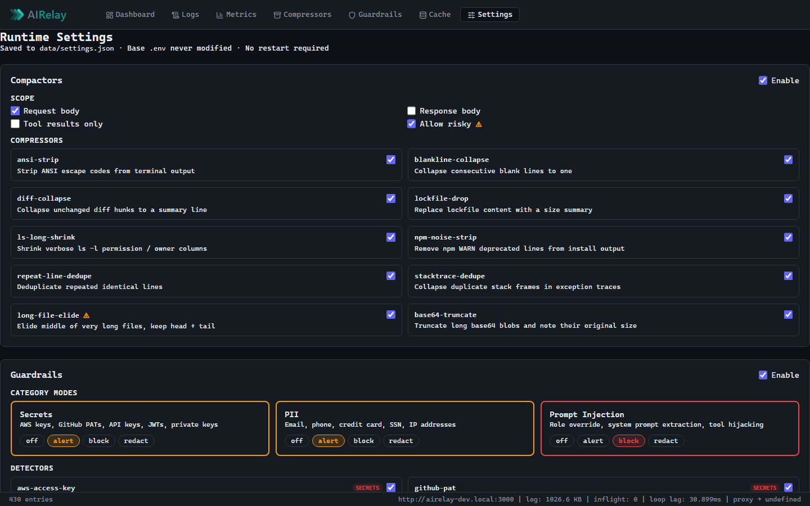

# AIRelay — Dashboard Screenshots

All screenshots taken against a live instance during a 430-request performance run (300 proxy calls across 5 models, 80 compactor calls with bloated payloads, 30 streaming calls, 20 guardrails-triggering calls). Compactor and Guardrails enabled; Dragonfly cache not connected.

---

## Dashboard

Landing tab. KPI row (total requests, session cost, p95 latency, bytes saved, cache hit rate), activity sparkline (RPS + p95 over the last 30 min), recent requests table, system health sidebar (Proxy / Compactors / Guardrails / Cache / in-flight), and a recommendations panel computed client-side.

---

## Logs

Live request log stream. Each entry shows timestamp, HTTP method, path, status, latency, bytes in/out, model badge, tokens, and cost. Filterable by log level and date; pauseable; clearable. Updates in real time via SSE.

---

## Metrics

Per-request metrics aggregated by time window. KPI cards cover cost (boot / 1m / projected), RPS, token throughput, latency percentiles (p95/p99), error rate, bytes in/out, compression ratio, and compressor fires. Three live sparkline charts: RPS, p95 latency, and token throughput (prompt/completion). Per-model breakdown table with sortable spend. CSV export.

---

## Compressors

Opt-in prompt compressor (Compactor). KPI row shows bytes saved, estimated tokens saved, compression ratio, and bypasses. Per-compressor table with fire counts and average latency. Recent events feed with scope, filters fired, bytes in → out, and any bypass reason. Enabled/disabled per compressor without restart via Settings.

---

## Guardrails

Opt-in prompt safety layer. Detectors grouped by category (secrets, PII, injection) each running in `off` / `alert` / `block` / `redact` mode. KPI row shows scanned requests, hits, blocks, redactions, and alerts. Recent events feed showing which detectors fired per request. Per-request bypass via `X-Guardrails: off`.

---

## Cache

Optional Dragonfly sidecar (Redis-compatible). Shows connection status, per-window and lifetime KPIs (hits, hit rate, bytes served from cache, dedup coalesced, spend rejects). Status row shows exact-match / dedup / spend-limits feature pills. Recent cache events feed. Zero overhead when Dragonfly is not connected.

---

## Settings

Runtime settings panel — no restart required. Compactors section: master toggle, scope controls (request body / response body / tool results only / allow risky), and per-compressor enable/disable cards. Guardrails section: master toggle and per-category mode cards (off / alert / block / redact) plus per-detector toggles. Cache section: master toggle, exact-match TTL, dedup, spend limits, and SSE fan-out. Changes are staged locally and saved to `data/settings.json` on Save.
